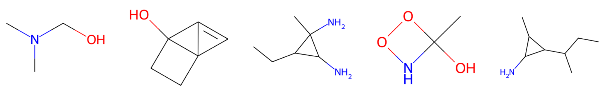
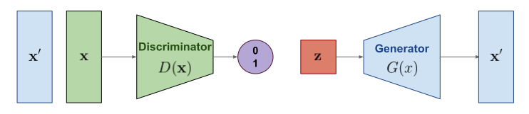
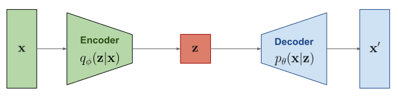

## Improving ELBO Computation in Graph Diffusion Models

#### Giulio Zani

#### Maastricht University

#### Msc Artificial Intelligence

---

### The Challenge of Molecular Generative Models

- **Status Quo**: Existing models struggle with accurate ELBO representation.
- **The Hurdle**: Ensuring both sample quality and computational efficiency.
- **The Quest**: To devise a training loss function that addresses these gaps.

Note: Mention graph compression

---

## 2. Research Question

    <i>Can we improve on the state-of-the-art ELBO computation using diffusion models on graphs while preserving permutation equivariance?</i>

---

## Background

---

### Generative Models

<!-- #### 4.1.1 Generative Models: An Overview -->

---

<!--  -->

---

---

---

---

---

#### 4.1.2 Common Types of Generative Models

---

#### 4.1.3 Limitations of Existing Generative Models

---

#### 4.1.4 Historical Development

---

### 4.2 Diffusion Models

---

#### 4.2.1 Introduction

---

#### 4.2.2 Gaussian Diffusion Models

---

#### 4.2.3 Discrete Diffusion Models

---

### 4.3 Diffusion Models on Graphs

---

#### 4.3.1 Graph Neural Networks

---

##### 4.3.1.1 The message passing framework

---

#### 4.3.2 Graph Transformer Networks

---

### 4.4 Deep Learning Framework

---

#### 4.4.1 JAX: Autograd and XLA

---

### 4.5 Hardware Acceleration

---

#### 4.5.1 GPUs: Evolution from graphics rendering to parallel computation

---

#### 4.5.2 TPUs: Introduction and motivation for development

---

## 5. Method

---

### 5.1 Introduction

---

### 5.2 Define the optimal graph representation

---

### 5.3 Computing Variational Lower Bound

---

### 5.4 Diffusion Process

---

#### 5.4.1 Forward Process

---

#### 5.4.2 Noise Schedule and Transition Probabilities

---

#### 5.4.3 Defining the Prior

---

#### 5.4.4 Marginalizing Over Timesteps

---

#### 5.4.5 Training Objective

---

## 6. Training Objective

---

### 6.1 Evaluation Metrics

---

### 6.2 Optimizing for Numerical Stability

---

### 6.3 Choice of Graph Neural Network

---

### 6.4 Choice of Dataset

---

### 6.5 Trainig on the computing platform

---

## 7. Experiments

---

### 7.1 Main Experiment: ELBO Computation

---

### 7.2 Molecule Generation

---

### 7.3 Qualitative Analysis

---

## 8. Conclusion

---

### 8.1 Summary of Contributions

---

### 8.2 Implications

---

### 8.3 Limitations

---

### 8.4 Future Directions

---
